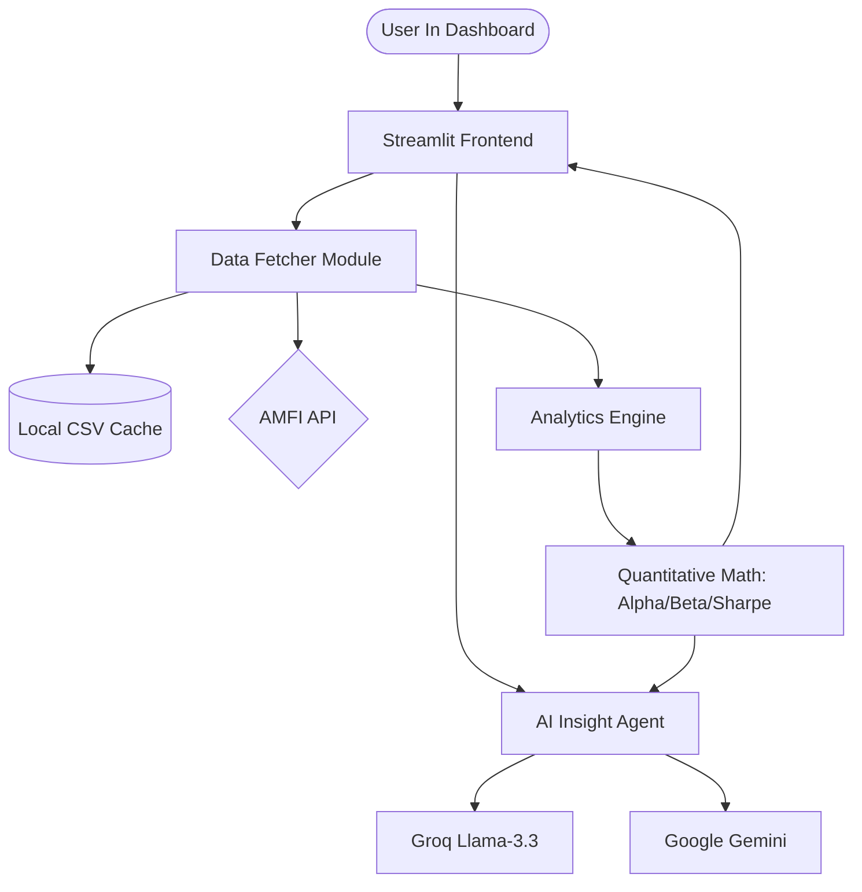

# 🔬 ConvexLab | Portfolio Intelligence (v1.1.0)

A high-performance, institutional-grade quantitative analysis dashboard for Indian Mutual Funds. Evaluate performance, risk, and consistency using advanced financial metrics and **High-Conviction AI Synthesis**.

> **Live Demo**: [convexlab.streamlit.app](https://convexlab.streamlit.app/)

---

## 🚀 v1.1.0 Special Edition: The AI Insight Agent

ConvexLab now features a state-of-the-art **AI Synthesis Engine** designed to transform complex multi-dimensional data into institutional investment memos.

*   🧠 **High-Conviction Synthesis**: Moves beyond generic summaries. The agent acts as a **Senior Quantitative Analyst**, providing definitive verdicts on alpha validity and downside behavior.
*   ⚡ **Dual-Engine Architecture**: Integrated with **Groq (Llama-3.3-70B)** for ultra-low-latency forensics and **Google Gemini 1.5 Flash** as a robust fallback.
*   ✨ **"Quiet Luxury" UI Rendering**: Custom-engineered **Deterministic CSS Container** with gold-left borders and institutional typography. No visible AI hashtags or formatting artifacts—just clean, decision-grade reports.
*   📊 **Analyst Briefing Mode**: Generates a dense, quantitative markdown briefing that can be exported directly into external AI models for deeper private forensics.

---

## 🛠️ Core Quantitative Capabilities

*   **Deep Performance Analysis**: Calculate CAGR, Absolute Growth, and Multiplier across multiple time horizons (1Y, 3Y, 5Y, 10Y, Max).
*   **Risk & Efficiency**: Compute advanced risk-adjusted metrics like **Sharpe Ratio**, **Sortino Ratio**, **Calmar Ratio**, and **Omega Ratio**.
*   🛡️ **Advanced Historical Stress-Testing**: Evaluate fund resilience during the **2024-25 (Market Correction)**, 2022 (Bear Market), COVID-19 Crash, 2018 NBFC Crisis, and the 2008 GFC.
*   **Market Character**: Identify fund style using **Beta**, **Jensen's Alpha**, and **Information Ratio** against benchmarks (Nifty 50, Nifty 500, Nifty 200).
*   **Capture Dynamics**: Analyze **Upside & Downside Capture Ratios** to understand behavior in varying market regimes.
*   **Rolling Returns**: Generate detailed rolling return distributions illustrating the probability of beating bank FDs and the frequency of negative returns.

---

## 🛠️ Architecture & Technology

The application follows a modular, professional Python architecture designed for speed, observability, and reliability:



### Technical Stack
*   **Intelligence Layer**: [Groq SDK](https://github.com/groq/groq-python) and [Google Generative AI](https://github.com/google-gemini/generative-ai-python).
*   **Frontend**: [Streamlit](https://streamlit.io/) with custom **CSS Injection** for premium branding.
*   **Visualization**: [Plotly](https://plotly.com/python/) for interactive, publication-quality financial charts.
*   **Analytics Engine**: [Pandas](https://pandas.pydata.org/), [NumPy](https://numpy.org/), and [SciPy](https://scipy.org/) for vectorized financial computations.
*   **Data Layer**: Custom robust integration with **AMFI API** (`mfapi.in`) and **yfinance** for index benchmarks.
*   **Dependency Governance**: Uses **`uv`** for deterministic builds, ensuring version-locked reproducibility.

---

## 📦 Installation & Setup

### 1. Clone & Initialize
```bash
git clone https://github.com/convexica/convexlab.git
cd convexlab
python -m venv venv
# Activate venv: source venv/bin/activate (Mac/Linux) or .\venv\Scripts\activate (Windows)
```

### 2. Install Dependencies
```bash
# Recommended (Fast & Deterministic)
uv sync

# Standard
pip install -r requirements.txt
```

### 3. Configure AI Secrets
Create a `.streamlit/secrets.toml` file in the root directory:
```toml
GROQ_API_KEY = "your_groq_key_here"
GEMINI_API_KEY = "your_gemini_key_here"
```

### 4. Run the Dashboard
```bash
streamlit run app/main.py
```

---

## 📁 Project Structure

```text
├── .github/workflows/       # CI/CD Guardian (Linting, Testing, Keep-Alive)
├── app/
│   ├── main.py              # UI Orchestration & Deterministic AI Renderer
│   ├── core/
│   │   ├── analytics.py     # Financial Engine & AI Prompt Framework
│   │   └── data_fetcher.py  # API Management & Cache Logic
│   └── components/
│       └── charts.py        # Reusable Plotly Financial Visuals
├── tests/                   # Automated Financial Validation
├── internal_docs/           # Architectural Guidelines & KI Records
├── pyproject.toml           # Modern Project Config (PEP 621)
└── LICENSE                  # MIT License
```

---

## ⚙️ Quality Assurance
*   **Linter**: Fast style checking with **Ruff**.
*   **Type Guard**: Strict static analysis with **Mypy**.
*   **Unit Tests**: Automated financial validation with **Pytest**.
*   **Maintenance**: Managed by **Dependabot** for zero-effort security updates.

---

## 📄 License
Distributed under the MIT License. See `LICENSE` for more information.

**Refining Alpha through Forensics 📈 [Convexica](https://convexica.com)**
ro-effort maintenance.


---

## 📄 License
Distributed under the MIT License. See `LICENSE` for more information.

**Developed with 📈 by [Convexica](https://convexica.com)**
