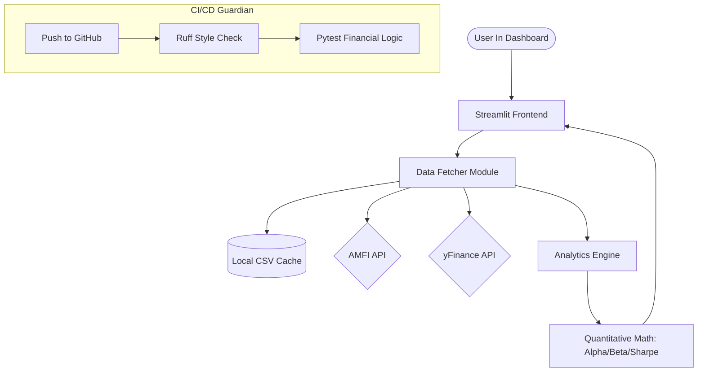

# 📈 India Fund Analytics

A high-performance, institutional-grade quantitative analysis dashboard for Indian Mutual Funds. Evaluate performance, risk, and consistency using advanced financial metrics.

> **Live Demo**: [india-fund-analytics.streamlit.app](https://india-fund-analytics.streamlit.app/)

---

## 🚀 Core Capabilities

*   **Deep Performance Analysis**: Calculate CAGR, Absolute Growth, and Multiplier across multiple time horizons (1Y, 3Y, 5Y, 10Y, Max).
*   **Risk & Efficiency**: Compute advanced risk-adjusted metrics like **Sharpe Ratio**, **Sortino Ratio**, **Calmar Ratio**, and **Omega Ratio**.
*   **Market Character**: Identify fund style using **Beta**, **Jensen's Alpha**, and **Information Ratio** against benchmarks (Nifty 50, Nifty 500).
*   **Capture Dynamics**: Analyze **Upside & Downside Capture Ratios** to understand how the fund behaves in varying market conditions.
*   **Rolling Returns**: Generate detailed rolling return profiles illustrating the probability of beating bank FDs and the frequency of negative returns.
*   **Consistency Metrics**: Measure trend intensity with the **Hurst Exponent (H)** and calculate **Batting Average** for outperformance frequency.

---

## 🛠️ Architecture & Technology

The application follows a modular, professional Python architecture designed for speed, observability, and reliability:



### Technical Stack
*   **Frontend**: [Streamlit](https://streamlit.io/) for a reactive, data-driven user interface.
*   **Visualization**: [Plotly](https://plotly.com/python/) for interactive, publication-quality financial charts.
*   **Analytics Engine**: [Pandas](https://pandas.pydata.org/), [NumPy](https://numpy.org/), and [SciPy](https://scipy.org/) for vectorized financial computations.
*   **Data Layer**: Custom robust integration with **AMFI API** (`mfapi.in`) with browser-mimicking headers and **yfinance** for index benchmarks.
*   **Persistence**: Built-in local file-based caching in `data/cache/` to minimize API latency and handle throttling.
*   **Observability**: Integrated **Structured Logging** for tracking API status, cache hits/misses, and error diagnostics.
*   **Type Integrity**: Enforced **Static Type Hinting** with **Mypy**, ensuring data types across the financial engine are validated before execution.
*   **Dependency Governance**: Uses **`uv`** for deterministic builds with a high-security `uv.lock` file, preventing "dependency drift." 


---

## 📦 Installation & Setup

### 1. Clone & Initialize
```bash
git clone https://github.com/convexica/india-fund-analytics.git
cd india-fund-analytics
python -m venv venv
```

### 2. Install Dependencies
Professional installations can use **`uv`** (recommended) for perfect reproducibility, or standard `pip`:
```bash
# Institutional Standard (Perfectly reproducible)
uv sync

# Legacy Standard (Standard install)
pip install -r requirements.txt
```

### 3. Setup Automation (Optional)
If you plan to run the keep-alive script or automated tests:
```bash
playwright install chromium
```

### 4. Run the Dashboard
```bash
streamlit run app/main.py
```

---

## 📁 Project Structure

```text
├── .github/workflows/
│   ├── ci_guardian.yml      # Automated Linting & Testing
│   └── keep_alive.yml       # Cloud Instance Wake-up
├── app/
│   ├── main.py              # User Interface & Orchestration
│   ├── core/
│   │   ├── analytics.py     # Financial Calculation Engine (Type-Hinted)
│   │   └── data_fetcher.py  # API Management & Structured Logging
│   └── components/
│       └── charts.py        # Reusable Plotly Visualizations
├── tests/
│   └── test_analytics.py    # Unit Tests for Math Engine
├── scripts/
│   └── wake_app.py          # Streamlit Cloud keep-alive automation
├── pyproject.toml           # Modern Project Configuration (PEP 621)
├── requirements.txt         # Consolidated Dependencies
└── LICENSE                  # MIT License
```

---

## ⚙️ Deployment & Quality Assurance

*   **Deployment**: Hosted on **Streamlit Cloud**.
*   **CI/CD**: Uses **GitHub Actions** for the **"CI Guardian"** workflow:
    *   **Linter**: Fast style checking with **Ruff**.
    *   **Type Guard**: Strict static analysis with **Mypy**.
    *   **Unit Tests**: Automated financial validation with **Pytest**.
*   **Automation**: A scheduled workflow runs every 6 hours using **Playwright** to prevent the instance from entering "sleep mode" on the free tier.
*   **Sustainability**: Managed by **Dependabot** to keep dependencies secure and up-to-date with zero-effort maintenance.


---

## 📄 License
Distributed under the MIT License. See `LICENSE` for more information.

**Developed with 📈 by [Convexica](https://convexica.com)**
